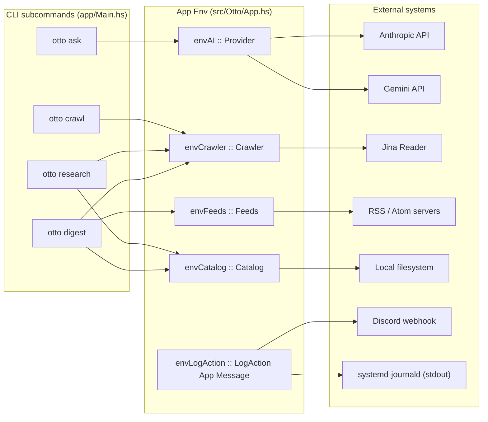
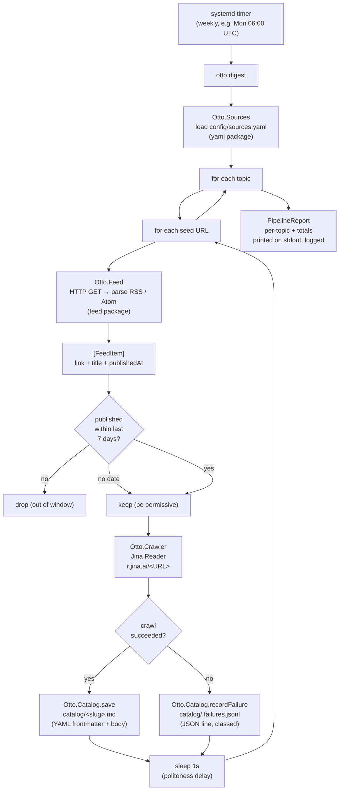

# Otto — system overview

End-to-end map of what the codebase actually does today, the data flow
behind `otto digest`, and the road from here. For repository conventions
and architectural principles, see [CLAUDE.md](../CLAUDE.md). For commit
history, see [CHANGELOG.md](../CHANGELOG.md). For per-module contracts,
read the Haddock blocks at the top of each `Otto.*` module.

> Otto's CLI is split along the catalog's read / write axis: **ingestion**
> commands (`research`, `crawl`, `digest`) write to the catalog and talk
> to the network; **synthesis** commands (`weekly`, planned) read the
> catalog and produce derived output. This keeps the dependencies of
> each command honest and the failure modes easy to reason about.

## 1. Mental model

Otto is a personal automation bot. Long-term it executes a stack of
recurring chores for the owner; short-term it owns one chore: produce
research material for a weekly blog post.

The collaboration model is **cyborg**: Otto researches and drafts, the
owner reviews, edits, and publishes. Cadence is **weekly**, not daily —
the editorial loop is the bottleneck, not the crawler, and a tighter
loop just inflates the catalog with noise.

## 2. Capabilities and the application environment

The application monad is `App = ReaderT Env IO`. Every long-running
operation reads from a single `Env` value that holds the configured
**capabilities**, each implemented as a record-of-functions ("handle")
swapped in at bootstrap and trivially mocked in tests.

| Capability       | Handle      | `Has*` class    | Built-in implementations             |
| ---------------- | ----------- | --------------- | ------------------------------------ |
| Logging          | `LogAction` | `HasLog`        | stdout + optional Discord webhook    |
| AI providers     | `Provider`  | `HasAI`         | Anthropic, Gemini, Mock, disabled    |
| URL fetcher      | `Crawler`   | `HasCrawler`    | Jina Reader, Mock, disabled          |
| Research store   | `Catalog`   | `HasCatalog`    | filesystem, disabled                 |
| Feed loader      | `Feeds`     | `HasFeeds`      | HTTP + `feed` package, disabled      |

New capabilities (database pool, job queue, …) follow the same shape:
record of `IO` actions, a tiny `Has*` class, a `disabledX` fallback for
when configuration is missing.



## 3. Module inventory

Single-package layout under `otto.cabal`. Modules grouped by capability;
each subtree follows the same shape (`Types`, `Error`, `Handle`,
implementation, `Mock`, facade module).

```text
src/Otto/
├── App.hs                # Env, App monad, HasX instances
├── Error.hs              # OttoError = AIError | CrawlError | ...
├── Logging.hs            # co-log bootstrap
│
├── AI/                   # Provider-agnostic AI layer
│   ├── Anthropic{,/Internal}.hs
│   ├── Gemini{,/Internal}.hs
│   ├── Mock.hs           # request capture + FIFO response queue
│   ├── Provider.hs       # Provider record, HasAI, disabledProvider
│   ├── Cli.hs            # ask flag parsing
│   ├── Config.hs         # OTTO_*_API_KEY loader
│   └── Types.hs / Error.hs
├── AI.hs                 # facade + buildProvider factory
│
├── Crawler/              # URL → canonical Markdown
│   ├── Jina{,/Internal}.hs   # r.jina.ai/<URL>
│   ├── Mock.hs
│   ├── Handle.hs / Config.hs / Types.hs / Error.hs
└── Crawler.hs            # facade + buildCrawler factory
│
├── Catalog/              # CrawlResult → durable storage
│   ├── FileSystem.hs     # <dir>/<slug>.md + .failures.jsonl
│   ├── Render.hs         # canonical YAML frontmatter + JSONL
│   ├── Handle.hs / Config.hs / Types.hs / Error.hs
└── Catalog.hs            # facade + buildCatalog factory
│
├── Feed/                 # RSS / Atom URL → [FeedItem]
│   ├── Http.hs           # http-client + feed package
│   ├── Handle.hs / Types.hs / Error.hs
└── Feed.hs               # facade + buildFeeds factory
│
├── Sources/              # config/sources.yaml registry
│   ├── File.hs           # YAML loader via the yaml package
│   ├── Config.hs / Types.hs / Error.hs
└── Sources.hs            # facade
│
└── Pipeline.hs           # runDigest orchestrator (otto digest)
```

The naming scheme is deliberate: the `Handle` module owns the record
type and its `Has*` class; the implementation module supplies a
`mkXImpl` constructor; the facade module re-exports the public surface
plus a `buildX` factory that picks an implementation.

## 4. Subcommands

Implemented in `app/Main.hs`:

| Command                | Purpose                                                                                                  |
| ---------------------- | -------------------------------------------------------------------------------------------------------- |
| `otto`                 | Startup probe — logs a banner, exits.                                                                    |
| `otto ask PROMPT`      | Sends `PROMPT` through the selected AI provider. `--provider` / `OTTO_PROVIDER` / default-to-anthropic.  |
| `otto crawl URL`       | Fetches URL via the crawler, prints canonical Markdown to stdout.                                        |
| `otto research URL`    | Fetches URL and persists it to the catalog. Crawl errors append a record to `.failures.jsonl`.           |
| `otto digest`          | Ingestion pipeline: load `config/sources.yaml`, fetch feeds, crawl, persist. See section 5.              |
| `otto weekly`          | Reserved — synthesis side (catalog → weekly draft). Lands with the draft-generation work item.           |
| `otto --help` / `-h`   | Prints usage and the list of recognized environment variables.                                           |

## 5. Workflow: `otto digest`

The ingestion pipeline. Driven from a systemd timer (weekly today) on
the production host; runnable locally via `cabal run otto -- digest`.



Key invariants:

- **Sequential per item.** No `async` / `concurrently`. Politeness to
  upstream and to Jina's free tier wins over latency. The natural
  upgrade path (when latency starts mattering) is per-topic
  concurrency; the orchestrator already isolates topic and item loops.
- **Catalog is the source of truth.** Slugs are deterministic
  (`FNV-1a 64-bit`), so re-crawling the same URL overwrites the same
  file — pipeline reruns are idempotent on a per-URL basis.
- **Failures are first-class.** A blocked or broken URL is not lost;
  it lands in `.failures.jsonl` with a stable error class tag
  (`blocked`, `network_error`, `decode_error`, …) ready for `jq`.
- **Recency window is permissive.** Items with no publication date are
  kept, not dropped — the crawler is the better arbiter of "is this
  worth saving". Stale items eventually fall out as feeds rotate.

### Configuration touchpoints

| Variable                   | Default                  | Purpose                                              |
| -------------------------- | ------------------------ | ---------------------------------------------------- |
| `OTTO_SOURCES_PATH`        | `./config/sources.yaml`  | Path to the topic / seed registry consumed by `digest`. |
| `OTTO_CATALOG_DIR`         | `./catalog`              | Root for `<slug>.md` and `.failures.jsonl`.          |
| `OTTO_JINA_API_KEY`        | (unset)                  | Optional; enables Jina's authenticated tier.         |
| `OTTO_DISCORD_WEBHOOK_URL` | (unset)                  | Optional; mirrors `Warning+` logs to Discord.        |

### Sources YAML schema

```yaml
sources:
  - topic: "topic-name"
    seeds:
      - https://example.com/feed.atom
      - https://example.com/another-feed.xml
  - topic: "another-topic"
    seeds:
      - https://example.com/feed.xml
```

`topic` is a free-form label that flows through to the catalog and
will eventually map to a blog category. `seeds` are RSS or Atom URLs.

The repository ships [`config/sources.yaml.example`](../config/sources.yaml.example);
the real `config/sources.yaml` is gitignored so the owner's actual
subscriptions stay out of source control. Copy the example and edit
locally before running `otto digest`.

## 6. What's already done

- ✅ Provider-agnostic AI layer (Anthropic + Gemini behind one
  abstraction; mock; provider selection via flag / env / default).
- ✅ Vendor-agnostic crawler layer (Jina Reader; mock; blocked-target
  detection via `Warning:` headers).
- ✅ Backend-agnostic catalog layer (filesystem; idempotent slug-based
  writes; failure log with stable error classes).
- ✅ Feed layer (HTTP + RSS / Atom parser; vendor-neutral `FeedItem`).
- ✅ Sources registry (YAML loader; `OTTO_SOURCES_PATH`).
- ✅ Ingestion pipeline (`otto digest`, sequential, with recency filter,
  per-topic / total reporting).
- ✅ Logging via `co-log` to stdout (journald) + optional Discord.
- ✅ ARM64 CI on every push / PR; 63 offline tests + env-gated
  integration tests for Anthropic, Gemini, Jina.

## 7. What's next

Listed in priority order. Each step is queued, not blocked.

1. **Live smoke run + integration spec.** Run `otto digest` on the
   real registry, observe the failure log, then add an env-gated
   `OTTO_PIPELINE_INTEGRATION` test that mirrors the Jina pattern.
2. **systemd unit + timer.** Drop a weekly timer that fires
   `otto digest` on the production VM; stdout flows into
   `journalctl -u otto`, warnings into Discord.
3. **URL discovery via AI.** Once stable native web search lands in
   Anthropic / Gemini, complement RSS with model-driven discovery
   ("find new posts in the last 7 days about X").
4. **Draft generation (`otto weekly`).** Given the populated catalog,
   the synthesis command reads it and asks the AI layer for a weekly
   post draft. Drafts go to a parallel `drafts/` tree for owner
   review. This is where the reserved `otto weekly` slot finally gets
   an implementation.
5. **PostgreSQL backing store.** Swap `mkFsCatalog` for a Postgres
   implementation when indexing / cross-topic queries start mattering.
   The handle pattern keeps this a module swap, not a rewrite.

## 8. Where to look next in the code

If you're reading this for the first time, start with:

- [src/Otto/App.hs](../src/Otto/App.hs) — `Env`, the `App` monad, the
  `Has*` instances. Five lines tell you how everything is wired.
- [src/Otto/Pipeline.hs](../src/Otto/Pipeline.hs) — `runDigest`. One
  module describes the entire ingestion flow.
- [src/Otto/Crawler.hs](../src/Otto/Crawler.hs) and
  [src/Otto/Catalog.hs](../src/Otto/Catalog.hs) — the cleanest
  examples of the handle pattern.
- [config/sources.yaml](../config/sources.yaml) — the live registry.
